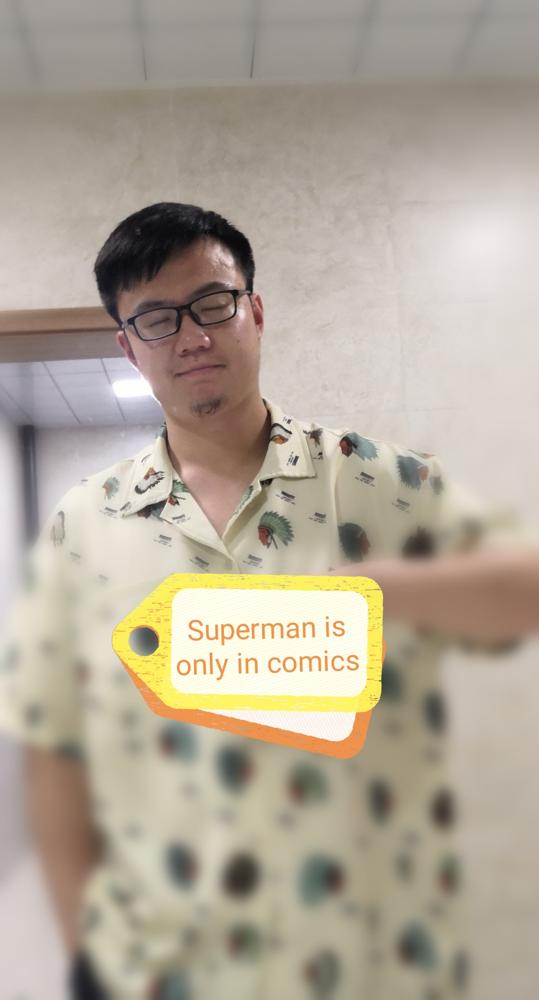

# David Li

  

 

* **Chinese name:** 李润泽(Run-ze Li)

* **English name:** David Li

* **Interest:** A data worker who is interested in Machine learning , NGS , Mathematical model and Database.

    
## Home

  

 

  

    I am a master student in the <a href='http://lst.hzau.edu.cn/'>College of Life Science and Technology</a> in <a href='http://www.hzau.edu.cn/'>Huazhong Agricultural University</a> and the major is genomics,which is a major in biological data analysis. I am interested in Applied Mathematics and Statistics,especially for applying mathematical theory to biology.When I am undergraduate,I have minored some related courses in applied statistics and developed a keen interest in how to apply mathematical models to biology.During the master degree, in first two years I worked in zebrafish and once analyzed NGS data(mainly RNA-seq,scRNA-seq).In last year my main job is to develop biology software,which is predicting dynamic G4 structure(G quadruplex).
  

  

    Before I got my master's degree,I have some programming skills(R,Python and maybe a little C++) and use machine learning models or mathematical models to analyze biological data(R:mlr,glmnet etc;Python:scikit-learn,sklearn,pytorch etc).I also participate in building biological database(flask + jquery or vue).I like to take notes while reading literature,recording the logic or principle of the article.It was a lot of fun in my learning process. Sometimes I will share my learning records or good ideas in the <a href='https://www.jianshu.com/u/ecfc4115cd90'>Jianshu</a> and <a href='https://www.yuque.com/u1629231/qd3xf6'>Yuque</a> (Welcome to discuss with me 😉)
  

  

     I am better at analyzing NGS data,during the analysis I can combine some mathematical models in the analysis data, the purpose is to better mine the biological story,if results are solid, I prefer to develop biological software for more researchers to use. At last, I share a slogan with all guys(but it is in Chinese): "學問求切實,思辨求翔實".
  

## Resume

**Education**

  + 2019 ~ 2022, Master Degree Genomics(Test-free recommended) College of Life Science and Technology, Huazhong Agricultural University. ***Thesis:*** 
  
  + 2015 ~ 2019, B.S Bioengineering, College of Life Science and Technology, Huazhong Agricultural University. ***Thesis: Establishment of a male zebrafish female 
torsion reversal model*** 

**Publication**

+ Lu Chen,Li Wang,Qiwei Cheng,Yi-Xuan Tu,Zhuang Yang,**Run-Ze Li**,Zhi-Hui Luo.[Anti-masculinization induced by aromatase inhibitors in adult female zebrafish](item_2.md), BMC Genomics,21,22(2020).

+ Involvement of ovary-biased developmentally dynamic lncRNA genes in reducing sexual plasticity of adult zebrafish,Lu Chen; Ru Zhang; Yi-Xuan Tu; Ying-Jie Geng; Run-Ze Li; Shan-Shan Yu; Zhuang Yang; Sheng Hu Qian; Jing-Min Zhang; Yonghua Sun; Zhen-Xia Chen(Co-first author, in press, Genome biology)

+ 陈振夏,陈露,**李润泽**,程奇伟,涂懿璇等,[甾体类化合物或其药学上可接受的盐在促进鱼类的性反转中的应用](item_1.md),中国, 专利号:201811302669.0 **(patent)**

**Grant**

+ 2015-2016 Outstanding Learning Award(During B.S)
+ 2016-2017 Outstanding Learning Award(During B.S)
+ 2017-2018 Outstanding Learning Award(During B.S)
+ 2019-2020 Scholarship(First prize,During the Master)
+ 2020-2021 Scholarship(Third prize,During the Master)
+ 2021-2022 Scholarship(Second prize,During the Master)

Haha!!! Most of the prize money goes to study and travel funds

**Presentation**

+ 2018, [International Symposium on Animal Genomics](http://lst.hzau.edu.cn/info/1190/4550.htm) (In group talk,***Thesis: How to build a zebrafish sex reversal model*** )
+ 2019, [Animal Genome and Epigenome Evolution Forum](https://www.sohu.com/a/341272766_739387) (In group talk,***Thesis:Transcriptomic analysis of early sex development in zebrafish***)
+ 2021, HZAU Information College Annual Meeting (Poster,***Thesis: [Using the deep learning model to truly predict the dynamic G4 structures](item_3.md)***)

**Academic community(club)**

+ Club: play with R **Translation：Discovering statistics using R**
+ Club: play with R **Translation：[R and meta analysis](item_4.md)**
+ Club: play with R **Translation：R and structural equation**
+ StatQuest for 2 courses'translation (Video,Josh Starmer)
+ [Bioinformatics Training Course in HZAU](http://lst.hzau.edu.cn/info/1072/2597.htm)
+ Some bioinformatics club's activities(haha,met a lot of friends)
+ [Jianshu](https://www.jianshu.com/u/ecfc4115cd90) Creator
+ **[Chinese Society of Optimization, Overall Planning and Economic Mathematics — Professional Committee Mathematical Modeling and Algorithms](http://www.scope.org.cn/)**. ([Organization member](item_5.md)).

  
## Research experience

**1.Construction of a zebrafish sex reversal model**

The main purpose of this study was to construct a model of sex reversal with the aim of studying sex development in zebrafish,and [patent](item_1.md) pending for related technology.

**2.Multi-omics analysis of sex development in zebrafish**

Multi-omics study based on zebrafish sex reversal model,this part is used as my master thesis ,The repositories is [here](https://github.com/hzaurzli/Aquatic-institute),but it's private, Cooperation tutor: [@yhsun](http://people.ucas.ac.cn/~yhsun)

**3.BertG4 development**

Accurate prediction of G4 from a multi-omics perspective based on Bert framework,Cooperation tutor: [@wenzhang](http://coi.hzau.edu.cn/info/1162/4523.htm) and the repositories is [BertG4](https://github.com/hzaurzli/BertG4)

**4.Build Devogene Database**

In this project, I am responsible for the construction of the database website, and the analysis content is completed by other colleagues. The repositories is [Devogene](https://github.com/hzaurzli/ddglnc)

## Tips

***I share most of them in [Jianshu page](https://www.jianshu.com/u/ecfc4115cd90) 😉 !!!***

**1. About bioinformatic**

If you wanna study bioinformatic by yourself here are some books and some videos:

* **BOOKS:** 《Encyclopedia of Bioinformatics and Computational Biology》

* **BOOKS:** 《生物信息学》 樊龙江
  
* **BOOKS:** [Basic Edition](https://lulab2.gitbook.io/teaching/) or [Enhanced version](https://lulab1.gitbook.io/teaching/)

* **VEDIOS:** [Xiaole Shirley Liu's course](https://links.jianshu.com/go?to=https%3A%2F%2Fcanvas.harvard.edu%2Fcourses%2F49497)

**2. About statistic**

* **BOOKS:** 《Practical Statistics for Data Scientists》

* **BOOKS:** 《Discovering statistics using R》

* Hence, if you wanna learn more about statistic models or how to use programming language to take statistic, please read more source codes.

**3. About programming**

* **R BOOKS:** 《advanced R》

* **PYTHON BOOKS:**  《Automate the Boring Stuff with Python: Practical Programming for Total Beginners》

## Contact
***If you wanna connect me or discuss with me, here are some basic informations:***

+ E-mail: yun_act@163.com or small.runze@gmail.com
+ Github: [Github address](https://github.com/hzaurzli/)
+ Twitter: [Twitter address](https://twitter.com/lirz96208886) -> Sharing some papers that I am interested in
+ Ins: [Ins address](https://www.instagram.com/small.runze/?hl=en)
+ Jianshu: [Link](https://www.jianshu.com/u/ecfc4115cd90)
+ Yuque: [Link](https://www.yuque.com/u1629231/qd3xf6)

